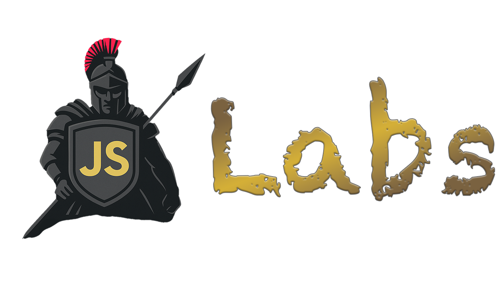

# JS Recon Labs



This repository contains labs for [JS Recon](https://github.com/shriyanss/js-recon). The apps in this repository have vulnerabilities to demonstrate the tool's capabilities.

> [!CAUTION]
> Do NOT expose these apps to the internet. These are intended to run locally, not in a production environment.
> If you like to live dangerously, go ahead!

## Labs

This repository contains multiple labs with multiple vulnerabilities. Following is a list of vulnerable labs you can test with JS Recon:

### Next.js

- [Next.js Fetch App](./next_js/fetch_app)
- [Next.js Axios App](./next_js/axios_app)
- [Next.js DOM XSS PostMessage App](./next_js/dom-xss-postMessage)
- [Next.js DOM XSS PostMessage JS URL App](./next_js/dom-xss-postMessage-jsUrl)

## Build all containers

To build all containers, you can run the following command:

```bash
docker build -t nextjs-fetch-app ./next_js/fetch_app
docker build -t nextjs-axios-app ./next_js/axios_app
docker build -t nextjs-dom-xss-postmessage ./next_js/dom-xss-postMessage
docker build -t nextjs-dom-xss-postmessage-jsurl ./next_js/dom-xss-postMessage-jsUrl
```

Once the all the containers are build, you can run those using:

```bash
docker run --rm -p 3000:3000 <lab_name>
```

## Walkthroughs

Video guides on setting up and solving these labs can be found on [JS Recon Site](https://js-recon.io/labs).
